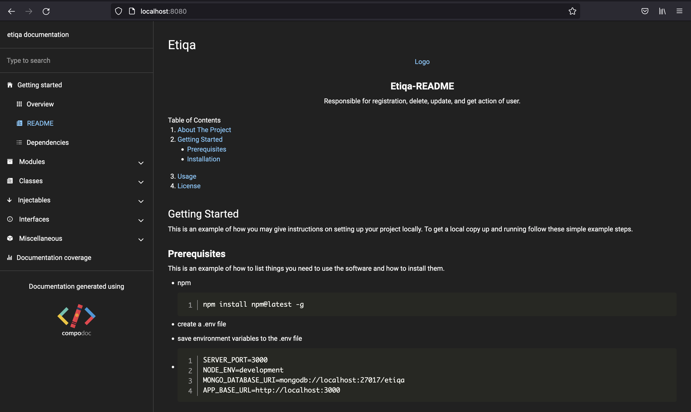

# Etiqa

<!-- PROJECT LOGO -->
<br />
<p align="center">
  <a href="https://github.com/othneildrew/Best-README-Template">
    
  </a>

  <h3 align="center">Etiqa-README</h3>

  <p align="center">
    Responsible for registration, delete, update, and get action of user.
  </p>
</p>

<!-- TABLE OF CONTENTS -->
<details open="open">
  <summary>Table of Contents</summary>
  <ol>
    <li>
      <a href="#about-the-project">About The Project</a>
    </li>
    <li>
      <a href="#getting-started">Getting Started</a>
      <ul>
        <li><a href="#prerequisites">Prerequisites</a></li>
        <li><a href="#installation">Installation</a></li>
      </ul>
    </li>
    <li><a href="#usage">Usage</a></li>
    <li><a href="#license">License</a></li>

  </ol>
</details>

<!-- GETTING STARTED -->

## Getting Started

This is an example of how you may give instructions on setting up your project locally.
To get a local copy up and running follow these simple example steps.

### Prerequisites

This is an example of how to list things you need to use the software and how to install them.

- npm

  ```sh
  npm install npm@latest -g
  ```

- create a .env file
- save environment variables to the .env file
- ```sh
  SERVER_PORT=3000
  NODE_ENV=development
  MONGO_DATABASE_URI=mongodb://localhost:27017/etiqa
  APP_BASE_URL=http://localhost:3000
  ```

### Installation

1. Clone the repo
   ```sh
   git clone git@github.com:leoan96/etiqa.git
   ```
2. Install NPM packages
   ```sh
   npm install
   ```
3. Start local MongoDB database
4. Start server
   ```sh
   npm run start:dev
   ```
5. Generate documentation
   ```sh
   npx @compodoc/compodoc -p tsconfig.json -s
   ```
6. Visit http://localhost:8080

### Alternative setup by using docker (start docker engine)

1. docker build -t backend .
2. docker run -p 3000:3000 backend

<!-- USAGE EXAMPLES -->

## Usage

You can utilize the api endpoints using either Postman(http://localhost:3000) or visiting its swagger endpoints(http://localhost:3000/api)




<!-- LICENSE -->

## License

Distributed under the MIT License. See `LICENSE` for more information.
